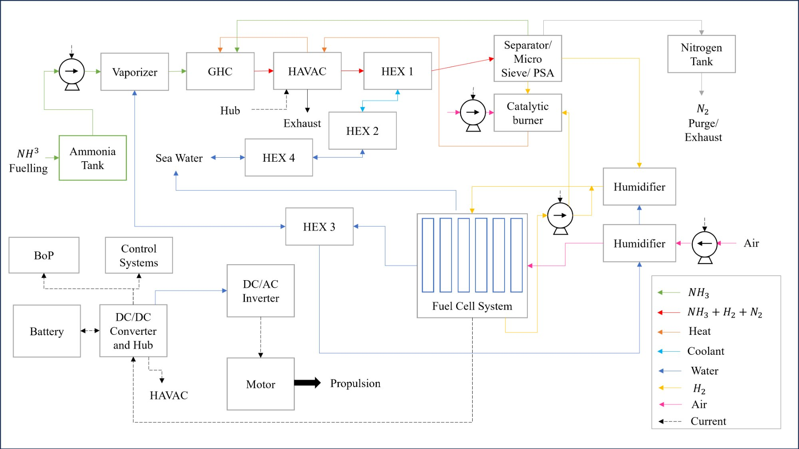

# Zero-Emission Ammonia-Powered Tugboat Design

[](https://www.python.org/downloads/)
[](https://opensource.org/licenses/MIT)

A thermodynamic and economic analysis tool for designing zero-emission ammonia-powered marine propulsion systems using PEM fuel cells.



## Overview

This project presents the design of a **1 MW zero-emission tugboat propulsion system** using ammonia as a hydrogen carrier. The system converts liquid ammonia to electrical power through on-board cracking and PEM fuel cells, achieving true zero-emission operation suitable for harbour environments.

The propulsion system employs a series hybrid architecture where ammonia serves as the primary energy carrier. Liquid ammonia is vaporised, thermally cracked to hydrogen and nitrogen, purified to fuel cell grade, and converted to electricity in PEM fuel cells. A lithium iron phosphate battery provides peak shaving, cold start capability, and regenerative braking energy storage.

The system is designed around autothermal operation, where waste hydrogen streams (PSA tail gas and fuel cell anode purge) are combusted to provide cracking heat. This approach eliminates the huge electrical load associated with electric heating (electric mode of HAVAC) and avoids using NH3 combustion that produces NOx emissions. The result is a near-zero emissions system achieved through catalytic hydrogen combustion. The startup is facilitated by the battery through resistive heating, which partially converts the ammonia to hydrogen, followed by ramping up to full autothermal conversion.

### Key Features

- **Autothermal Operation**: Waste hydrogen from PSA tail gas and anode purge provides cracking heat
- **Anode Recirculation**: Continuous purge mode ensures stable combustor operation (85% fuel utilisation)
- **Complete Mass & Energy Balance**: Rigorous thermodynamic calculations with validation checks
- **Economic Analysis**: OPEX comparison with diesel baseline including carbon pricing

## Design Specifications

| Parameter | Value | Notes |
|-----------|-------|-------|
| Net propulsion power | 1,000 kW | At propeller shaft |
| Operational endurance | 12 hours | Without refuelling |
| Fuel cell capacity | 2,000 kW | 10 × 200 kW modules |
| FC gross output | 1,660 kW | At design point |
| FC utilisation | 83% | Margin for degradation |
| Balance of Plant | 500 kW | 30% of FC output |
| NH₃ consumption | 890 kg/h | At full power |
| System efficiency | 23% | LHV basis |
| Tank capacity | ~13 tonnes | 12h + 15% margin |
| Local emissions | Zero | CO₂, SOx, PM |

*Detailed specifications are discussed in the design report*

## Installation

```bash
# Clone the repository
git clone https://github.com/Inigo-Antony/zero-emission-ammonia-powered-tugboat.git
cd zero-emission-ammonia-powered-tugboat

# Run the calculator (no dependencies required)
python src/tugboat_calculator.py
```

### System Efficiency

```
η_system = P_useful / E_input = 1,050 / 4,600 = 22.8% ≈ 23%
```

### Economic Comparison 

| Cost Component | Green NH₃ | Diesel Baseline |
|----------------|-----------|-----------------|
| Fuel cost | $2,400,000 | $528,000 |
| Carbon cost | $0 | $211,000 |
| Other costs (10%) | $240,000 | $74,000 |
| **Total OPEX** | **$2,640,000** | **$813,000** |
| **Premium** | **3.25×** | baseline |

### Lifecycle Emissions 

| Fuel Pathway | CO₂ (t/yr) | vs Diesel |
|--------------|------------|-----------|
| Diesel (baseline) | 2,110 | — |
| Grey NH₃ (@1.9) | 5,070 | +141% |
| Blue NH₃ (@0.2) | 534 | -75% |
| **Green NH₃** | **0** | **-100%** |

## Project Structure

```
zero-emission-ammonia-powered-tugboat/
├── README.md
├── LICENSE
├── requirements.txt
├── src/
│   ├── __init__.py
│   └── tugboat_calculator.py
├── design/
│   └── design_methodology.md
│   └── assumptions.md
├── diagrams/
│   └── system_block_diagram.png
├── results/
│   └── sample_output.txt
└── design-report/
    └── Zero-Emission-Ammonia_Tugboat-Power-System-Design.pdf
```

## References

1. Eluwah, C. & Fennell, P.S. (2024). Hybrid Air-Volt Ammonia Cracker (HAVAC) process. *Energy Advances*, 3(10), 2627-2647.
2. Amogy (2024). NH₃ Kraken Tugboat Demonstration.

## License

MIT License - see [LICENSE](LICENSE)

## Author

**Inigo** - MSc Sustainable Energy Systems, University of Birmingham and IIT Madras

## Comments

This study represents a first-principles thermodynamic and techno-economic model. Real-world deployment would involve additional efficiency penalties, dynamic load behaviour, degradation effects, and significant CAPEX considerations, all critical factors for commercial viability. Developments in tank types (Compressed NH3), other parasitic loads, and downtime calculations can be made to improve the project. 

*Originally developed as part of MSc coursework and further refined independently*
